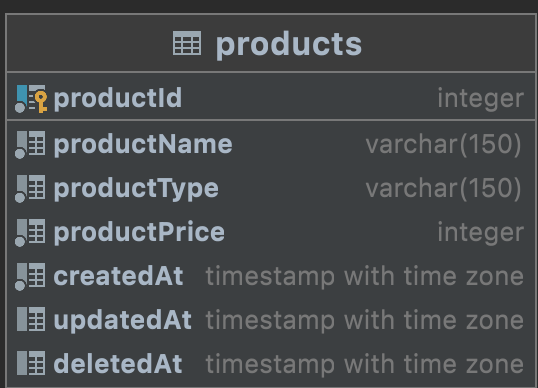

## Author

Hamlet Hovhannisyan

## Description

Simple placemarket with some initial functionality required by Renderforest

## Installation

```bash
$ npm install
```

## Running the app

```bash
# local stage
$ npm run start

# dev stage
$ npm run start:dev

# production stage
$ npm run start:prod
```

## Database model



## Architecture description

Project main functionality divided in api and services folders

- API Rest api designed using Express.js
  - Products Router, have a serveral functionalities [a link](src/app/api/products-router.js)
    - Get all products
    - Create product
    - Delete product
  - Search Router, have a serveral fucntionalities [a link](src/app/api/search-router.js)
    - Search product
